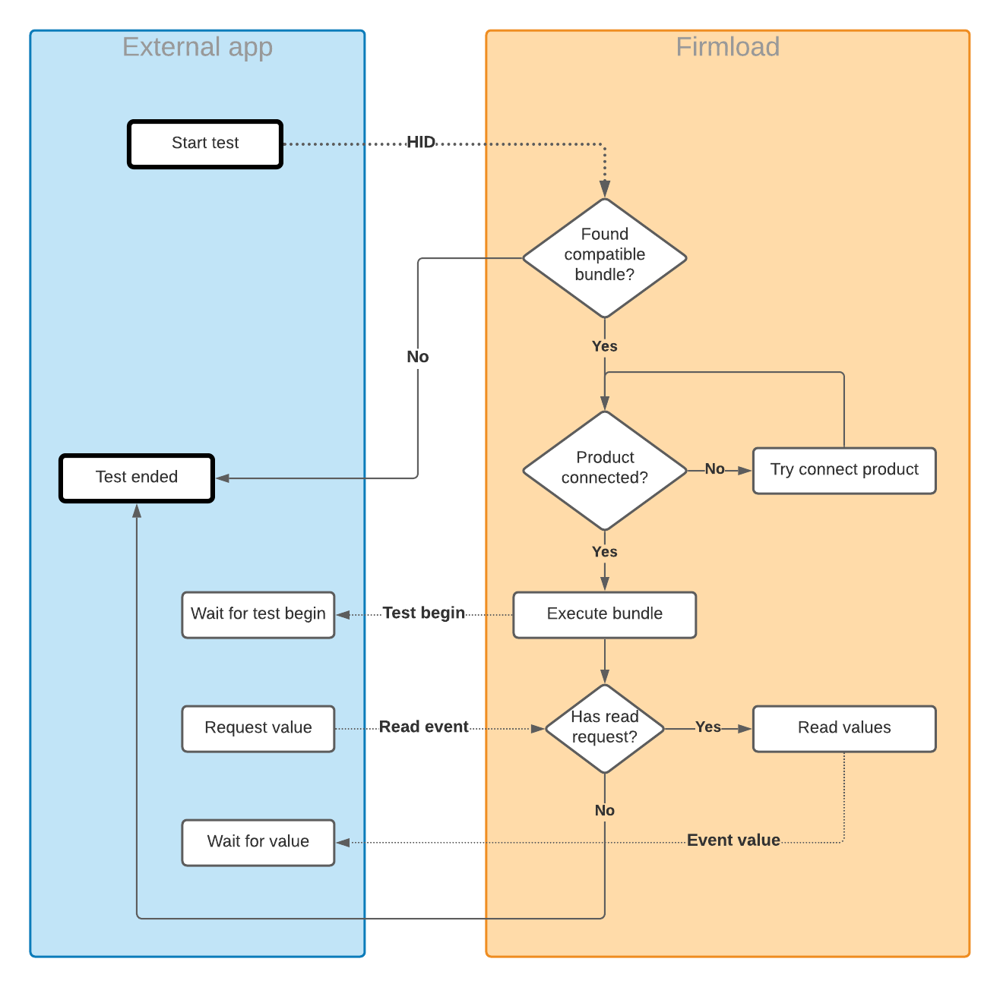

# Firmload Jig Demo - Socket edition

## Overivew
Firmload is built upon the TIF framework which provides a protocol agnostic, generic, interface to any kind of product. This allows Firmload to add support for any kind of hardware - such as PLCs.

### Required components:
* External app which supports Firmload JIG protocol
* Firmload application
* Bundle to read or write to a product.
* Tif-file contaning the messages that can be sent and received

***

# How to run

1. Build the project
2. Copy bin\jigDemo.zip to 'c:\production-tools\bundles'
3. Launch Firmload, set JIG mode to server.
4. Launch the built project.

***

## Interaction sequence
1. External app sends either PNC, HID or QR code to Firmload.
2. Firmload tries to locate a bundle which supports the article number.
   * If no bundle is found, the "Test ended" event is sent back to the app.
   * If a bundle is found, Firmload waits for a product to be connected.
3. When both a supported bundle is loaded and a product is connected - the "Test.Started" event is sent back to the app. Firmload then proceeds to execute the scripts inside the bundle.
4. The bundle checks periodically for events (requests) from the jig, reads or writes to the product, then returns the result.
5. When the bundle (script) is finished, Firmload sends a "Test.Ended" event containing a detailed report.



***

# Protocol specification
JIG to Firmload communication is based around that Firmload (and the executing bundle) waits for incoming events, performs an action then sends a response, then moves to wait for the next instruction. Example:

1. External app: Send Test.Begin event with HID
2. Firmload: Find and start bundle, send response Test.Started
3. Bundle: Initialize product, wait for events
4. External app: Send Read.MotorRpm event
5. Bundle: Get event, read MotorRpm, send response
6. ...
7. Firmload: Bundle done, send Test.Finished response with report.

## Messages
All messages contains a header consisting of a Method/Event "Family" which is a namespace or group followed by a "Command" or "Name". Then a list of arguments where each argument is separated by a space. Each message ends with \r\n. 

### Argument types

* Bool - Send as 0 or 1
* Numbers - Sends as integer values -2147483648 to 2147483648
* String - Wrap in "
* Objects - Complex responses is sent as base64-encoded JSON strings.

### Examples

```javascript
 //Single integer argument
>> Request.SetMaxSpeed 3200\r\n
```
```javascript
 //String and integer argument
>> Request.SetProductNameAndVersion "Awesome product" 320\r\n
```

## Events
All requests from the external app to Firmload and the bundle must be prefixed with "EVENT" but then follows the same structure as an message.

Format: "EVENT Family.Name arg1 arg2 ... \r\n"

### Examples
```javascript
// outgoing
EVENT Test.Begin "https://hqr.codes?hid=970494102HYP2021354001309"\r\n

// incoming
Test.Started "aGVsbG8gY2FrZQ=="\r\n
```

```javascript
// outgoing
EVENT Request.MotorRpm\r\n

// incoming
Response.MotorRpm 500\r\n
```


# Built in events
The following events are supported by default and will be intercepted by Firmload before being routed to a bundle.

## Events

| Event name | Parameters | Description | Triggers response
|-|-|-|-|
| Test.Begin | barcode - Ascii | Passes a complete QR-code, HID or PNC into Firmload. This has the same effect as scanning a physical barcode. Once the a product have been connected and a barcode have been received, the selected bundle will begin executing. | Test.Started |

## Responses

| Method name | Parameters | Description | Triggers response
|-|-|-|-|
| Test.Started | bundle - Ascii | Sent back to the connected client when a matching bundle have been found, a product have been connected and the bundle have started executing. The passed 'bundle' parameter is bas64 encoded JSON structure contaning the contents of the 'index.json' in the executing bundle.
| Test.Ended | success: bool, result - Ascii | Sent to the connected client when the bundle stops executing (for any reason). The first argument is 1 if the bundle executed without any errors. Second argument is a base64 encoded JSON-string contaning a detailed report see [event file specification](https://dev.azure.com/hqv-mit/CPMS%20Events/_git/CPMS%20Events?path=/docs/event-v4.md&_a=preview)


# Mandatory bundle contents
Besides the usual stuff, index.json, scripts and hex files, the bundle must also contain a "tif.jig.json" file which must contain all events and responses that Firmload, the bundle and the jig should be able to pass between each other. 

tif.jig.json _must_ at a minimum contain the following:
```json
{
  "events": [
    {
      "family": "Test",
      "name": "Begin",
      "description": "Raised by an external app when a QR-code, HID or PNC have been read. The event MUST have a tag  with value 'read:barcode'.",
      "params": [
        {
          "description": "Required, indicates that this parameter contains the value of intressed.",
          "name": "barcode",
          "type": "ascii",
          "tags": [ "value" ]
        }
      ],
      "protocol": [],
      "tags": [ "read:barcode" ]
    }
  ],
  "methods": [
    {
      "description" : "Used for JIG-keep alive.",
      "family": "System",
      "command": "DeviceInfo",
      "tags": [],
      "outParams": [],
      "inParams": [],
      "protocol": []
    },
    {
      "description" : "Invoked by Firmload when a test have finished executing (or failed to start).",
      "family": "Test",
      "command": "Ended",
      "outParams": [],
      "inParams": [
        {
          "description": "True if the test executed without any errors. False of the test didnt start or exited with error(s).",
          "name": "success",
          "type": "bool"
        },
        {
          "description": "Base64 JSON object contaning test report. See event format.",
          "name": "result",
          "type": "ascii"
        }
      ],
      "protocol": []
    },
    {
      "description" : "Invoked by Firmload when a test have begun executing. After this method have been called it is safe to start sending events to the bundle",
      "family": "Test",
      "command": "Started",
      "outParams": [],
      "inParams": [
        {
          "description": "Base64 JSON object contaning the 'index.json' contents of the bundle that are about to be executed.",
          "name": "bundle",
          "type": "ascii"
        }
      ],
      "protocol": []
    }
  ]
}
```